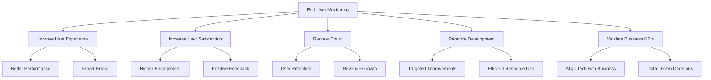
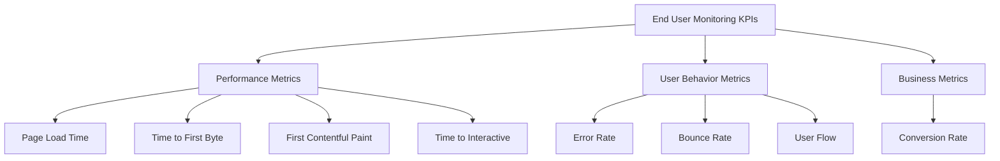

# Lecture 5: End User Monitoring - Overview and Objectives

## 1. Introduction to End User Monitoring (10 minutes) 👥

End User Monitoring (EUM) is the practice of tracking and analyzing the experience of users as they interact with your application. It focuses on understanding how users perceive your application's performance, functionality, and usability.

Key aspects of EUM:
- Performance monitoring from the user's perspective
- User behavior analysis
- Error tracking and impact assessment
- User journey mapping

## 2. Objectives of End User Monitoring (15 minutes) 🎯

1. **Improve User Experience**: Identify and resolve issues that directly impact users.
2. **Increase User Satisfaction**: Ensure the application meets or exceeds user expectations.
3. **Reduce Churn**: Identify and address issues before they cause users to abandon the application.
4. **Prioritize Development Efforts**: Focus on improvements that have the most significant impact on users.
5. **Validate Business KPIs**: Ensure that technical performance aligns with business goals.

Let's create a simple diagram to illustrate these objectives:



## 3. Implementing Basic End User Monitoring (30 minutes) 💻

Let's enhance our Flask application to include some basic end user monitoring capabilities. We'll use a combination of server-side and client-side techniques.

1. Update your `app.py` to include timing information:

```python
from flask import Flask, Response, request, render_template_string
import time
from prometheus_client import Counter, Histogram, generate_latest, CONTENT_TYPE_LATEST

app = Flask(__name__)

# Existing metrics
REQUESTS = Counter('http_requests_total', 'Total HTTP Requests', ['method', 'endpoint'])
LATENCY = Histogram('http_request_duration_seconds', 'HTTP request latency in seconds')

# New metrics for EUM
PAGE_LOAD_TIME = Histogram('page_load_time_seconds', 'Page load time in seconds')
USER_ERRORS = Counter('user_errors_total', 'Total user-facing errors')

@app.route('/')
def hello():
    REQUESTS.labels(method='GET', endpoint='/').inc()
    start_time = time.time()
    
    # Simulate some processing time
    time.sleep(0.1)
    
    duration = time.time() - start_time
    LATENCY.observe(duration)
    
    return render_template_string('''
        <!DOCTYPE html>
        <html>
        <head>
            <title>Hello, DevOps Monitoring!</title>
            <script>
                window.addEventListener('load', function() {
                    var loadTime = performance.now();
                    var xhr = new XMLHttpRequest();
                    xhr.open('POST', '/log-page-load', true);
                    xhr.setRequestHeader('Content-Type', 'application/x-www-form-urlencoded');
                    xhr.send('load_time=' + loadTime);
                });
            </script>
        </head>
        <body>
            <h1>Hello, DevOps Monitoring!</h1>
            <p>This page includes basic end user monitoring.</p>
            <button onclick="simulateError()">Simulate User Error</button>
            <script>
                function simulateError() {
                    var xhr = new XMLHttpRequest();
                    xhr.open('POST', '/log-user-error', true);
                    xhr.send();
                    alert('User error simulated!');
                }
            </script>
        </body>
        </html>
    ''')

@app.route('/log-page-load', methods=['POST'])
def log_page_load():
    load_time = float(request.form['load_time']) / 1000  # Convert to seconds
    PAGE_LOAD_TIME.observe(load_time)
    return '', 204

@app.route('/log-user-error', methods=['POST'])
def log_user_error():
    USER_ERRORS.inc()
    return '', 204

@app.route('/metrics')
def metrics():
    return Response(generate_latest(), mimetype=CONTENT_TYPE_LATEST)

if __name__ == '__main__':
    app.run(host='0.0.0.0', port=5000)
```

2. Rebuild and restart your Docker container:

```bash
docker build -t flask-app .
docker stop flask-container
docker rm flask-container
docker run -d -p 5000:5000 --name flask-container flask-app
```

3. Add new panels to your Grafana dashboard:
   - Page Load Time: `rate(page_load_time_seconds_sum[5m]) / rate(page_load_time_seconds_count[5m])`
   - User Errors: `rate(user_errors_total[5m])`

## 4. Real User Monitoring (RUM) vs Synthetic Monitoring (20 minutes) 🆚

End User Monitoring can be broadly categorized into two approaches: Real User Monitoring (RUM) and Synthetic Monitoring.

### 4.1 Real User Monitoring (RUM)

RUM involves collecting data from actual users as they interact with your application.

Pros:
- Provides insights into actual user experiences
- Captures real-world scenarios and edge cases
- Helps identify issues specific to certain user segments

Cons:
- Can be affected by factors outside your control (e.g., user's internet connection)
- Requires high traffic for meaningful data
- Privacy concerns with data collection

### 4.2 Synthetic Monitoring

Synthetic monitoring involves simulating user interactions with your application.

Pros:
- Consistent and controlled testing environment
- Can test critical paths even during low traffic periods
- Helps identify issues before they impact real users

Cons:
- May not capture all real-world scenarios
- Can be complex to set up and maintain
- May not reflect actual user behavior perfectly

Let's implement a basic synthetic monitoring script:

Create a new file `synthetic_monitor.py`:

```python
import requests
import time
from prometheus_client import CollectorRegistry, Gauge, push_to_gateway

registry = CollectorRegistry()
synthetic_latency = Gauge('synthetic_latency_seconds', 'Synthetic test latency in seconds', registry=registry)

def run_synthetic_test():
    start_time = time.time()
    response = requests.get('http://localhost:5000')
    duration = time.time() - start_time
    
    synthetic_latency.set(duration)
    
    # Push to Pushgateway
    push_to_gateway('localhost:9091', job='synthetic_monitor', registry=registry)

    print(f"Synthetic test completed. Latency: {duration:.2f} seconds")

if __name__ == '__main__':
    while True:
        run_synthetic_test()
        time.sleep(60)  # Run test every minute
```

Run this script in a separate terminal:

```bash
python synthetic_monitor.py
```

Add a new panel to your Grafana dashboard for synthetic latency:
- Query: `synthetic_latency_seconds`

## 5. Key Performance Indicators (KPIs) for End User Monitoring (15 minutes) 📊

When implementing EUM, it's crucial to focus on the right metrics. Here are some important KPIs:

1. **Page Load Time**: Time taken for a page to fully load
2. **Time to First Byte (TTFB)**: Time taken for the browser to receive the first byte of response
3. **First Contentful Paint (FCP)**: Time when the first content is painted on the screen
4. **Time to Interactive (TTI)**: Time taken for the page to become fully interactive
5. **Error Rate**: Percentage of requests that result in errors
6. **Bounce Rate**: Percentage of users who leave after viewing only one page
7. **User Flow**: Path users take through your application
8. **Conversion Rate**: Percentage of users who complete a desired action

Let's create a visualization of these KPIs:



## 6. Hands-on Exercise: Implementing Advanced End User Monitoring (30 minutes) 🏗️

In this exercise, you'll implement more advanced end user monitoring techniques using the open-source Prometheus and Grafana stack.

1. Update your `app.py` to include more detailed user journey tracking:

```python
from flask import Flask, Response, request, render_template_string, make_response
import time
import uuid
from prometheus_client import Counter, Histogram, generate_latest, CONTENT_TYPE_LATEST

app = Flask(__name__)

# Existing metrics
REQUESTS = Counter('http_requests_total', 'Total HTTP Requests', ['method', 'endpoint'])
LATENCY = Histogram('http_request_duration_seconds', 'HTTP request latency in seconds')
PAGE_LOAD_TIME = Histogram('page_load_time_seconds', 'Page load time in seconds')
USER_ERRORS = Counter('user_errors_total', 'Total user-facing errors')

# New metrics for user journey
USER_JOURNEYS = Counter('user_journeys_total', 'Total user journeys', ['path'])

@app.route('/')
def hello():
    REQUESTS.labels(method='GET', endpoint='/').inc()
    start_time = time.time()
    
    # Check if user has a journey cookie, if not, create one
    user_journey = request.cookies.get('user_journey')
    if not user_journey:
        user_journey = str(uuid.uuid4())
    
    # Update user journey
    USER_JOURNEYS.labels(path='start').inc()
    
    duration = time.time() - start_time
    LATENCY.observe(duration)
    
    response = make_response(render_template_string('''
        <!DOCTYPE html>
        <html>
        <head>
            <title>Hello, DevOps Monitoring!</title>
            <script>
                window.addEventListener('load', function() {
                    var loadTime = performance.now();
                    var xhr = new XMLHttpRequest();
                    xhr.open('POST', '/log-page-load', true);
                    xhr.setRequestHeader('Content-Type', 'application/x-www-form-urlencoded');
                    xhr.send('load_time=' + loadTime);
                });
            </script>
        </head>
        <body>
            <h1>Hello, DevOps Monitoring!</h1>
            <p>This page includes advanced end user monitoring.</p>
            <button onclick="simulateError()">Simulate User Error</button>
            <a href="/page2">Go to Page 2</a>
            <script>
                function simulateError() {
                    var xhr = new XMLHttpRequest();
                    xhr.open('POST', '/log-user-error', true);
                    xhr.send();
                    alert('User error simulated!');
                }
            </script>
        </body>
        </html>
    '''))
    
    # Set user journey cookie
    response.set_cookie('user_journey', user_journey)
    
    return response

@app.route('/page2')
def page2():
    REQUESTS.labels(method='GET', endpoint='/page2').inc()
    USER_JOURNEYS.labels(path='page2').inc()
    return "This is Page 2"

@app.route('/log-page-load', methods=['POST'])
def log_page_load():
    load_time = float(request.form['load_time']) / 1000  # Convert to seconds
    PAGE_LOAD_TIME.observe(load_time)
    return '', 204

@app.route('/log-user-error', methods=['POST'])
def log_user_error():
    USER_ERRORS.inc()
    return '', 204

@app.route('/metrics')
def metrics():
    return Response(generate_latest(), mimetype=CONTENT_TYPE_LATEST)

if __name__ == '__main__':
    app.run(host='0.0.0.0', port=5000)
```

2. Rebuild and restart your Docker container.

3. Add new panels to your Grafana dashboard:
   - User Journeys: `sum(rate(user_journeys_total[5m])) by (path)`

4. Create a user flow diagram in Grafana using the Flowchart plugin:
   - Install the Flowchart plugin in Grafana
   - Create a new panel and select Flowchart as the visualization
   - Use the following JSON to create a basic user flow:

```json
{
  "nodes": [
    {"id": "start", "label": "Start"},
    {"id": "page2", "label": "Page 2"}
  ],
  "edges": [
    {"from": "start", "to": "page2", "label": "{{user_journeys_total{path=\"page2\"} | last}}"}
  ]
}
```

## Conclusion and Next Steps 🎯

In this lecture, we've explored the concept of End User Monitoring, its objectives, and implementation strategies. We've enhanced our Flask application to include basic EUM capabilities, discussed the differences between Real User Monitoring and Synthetic Monitoring, and implemented advanced user journey tracking.

For the next lecture, we'll dive deeper into the types of end user monitoring, focusing on real user monitoring techniques and tools.

## Additional Resources 📚

1. Google's Web Vitals: https://web.dev/vitals/
2. "Implementing Service Level Objectives" by Alex Hidalgo
3. Real User Monitoring vs Synthetic Monitoring: https://raygun.com/blog/real-user-monitoring-vs-synthetic-monitoring/
4. Grafana Flowchart Plugin: https://grafana.com/grafana/plugins/agenty-flowcharting-panel/

