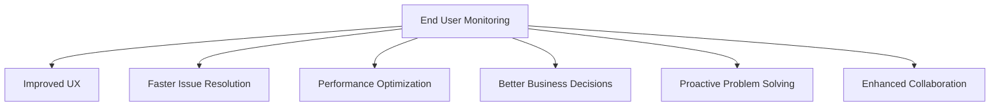

# Lecture 6: Types of End User Monitoring and Benefits

## 1. Introduction (5 minutes) 🌟

We'll explore different types of End User Monitoring (EUM) and their benefits in a DevOps context.

## 2. Types of End User Monitoring (30 minutes) 🔍

### 2.1 Real User Monitoring (RUM) (10 minutes)

RUM collects data from actual users interacting with your application.

Key aspects:
- Captures real-world experiences
- Provides insights into user behavior
- Identifies issues specific to user segments or locations

Example: Add RUM to Flask app (simplified version):

```python
from flask import Flask, request
from prometheus_client import Counter, Histogram

app = Flask(__name__)

PAGE_LOAD_TIME = Histogram('page_load_time_seconds', 'Page load time in seconds')
USER_INTERACTIONS = Counter('user_interactions_total', 'Total user interactions', ['type'])

@app.route('/')
def hello():
    return '''
        <html>
            <body>
                <h1>RUM Demo</h1>
                <script>
                    window.addEventListener('load', function() {
                        var loadTime = performance.now();
                        fetch('/log-page-load', {
                            method: 'POST',
                            body: JSON.stringify({load_time: loadTime}),
                            headers: {'Content-Type': 'application/json'}
                        });
                    });

                    document.addEventListener('click', function() {
                        fetch('/log-interaction', {
                            method: 'POST',
                            body: JSON.stringify({type: 'click'}),
                            headers: {'Content-Type': 'application/json'}
                        });
                    });
                </script>
            </body>
        </html>
    '''

@app.route('/log-page-load', methods=['POST'])
def log_page_load():
    data = request.json
    PAGE_LOAD_TIME.observe(data['load_time'] / 1000)
    return '', 204

@app.route('/log-interaction', methods=['POST'])
def log_interaction():
    data = request.json
    USER_INTERACTIONS.labels(type=data['type']).inc()
    return '', 204

if __name__ == '__main__':
    app.run(host='0.0.0.0', port=5000)
```

### 2.2 Synthetic Monitoring (10 minutes)

Synthetic Monitoring simulates user interactions to proactively identify issues.

Key aspects:
- Provides consistent and controlled testing
- Allows testing of critical paths during low traffic
- Helps identify issues before impacting real users

Example: Basic synthetic monitoring script:

```python
import requests
import time
from prometheus_client import Gauge, push_to_gateway

synthetic_latency = Gauge('synthetic_latency_seconds', 'Synthetic test latency in seconds')

def run_synthetic_test():
    start_time = time.time()
    requests.get('http://localhost:5000')
    duration = time.time() - start_time
    synthetic_latency.set(duration)
    push_to_gateway('localhost:9091', job='synthetic_monitor')

if __name__ == '__main__':
    while True:
        run_synthetic_test()
        time.sleep(60)  # Run test every minute
```

### 2.3 Session Replay (10 minutes)

Session Replay records and replays user sessions to understand behavior and identify issues.

Simple example (logging clicks):

```python
SESSION_EVENTS = []

@app.route('/log-session-event', methods=['POST'])
def log_session_event():
    data = request.json
    SESSION_EVENTS.append(data)
    return '', 204

# Add to your JavaScript:
document.addEventListener('click', function(e) {
    fetch('/log-session-event', {
        method: 'POST',
        body: JSON.stringify({
            type: 'click',
            target: e.target.tagName,
            timestamp: Date.now()
        }),
        headers: {'Content-Type': 'application/json'}
    });
});
```

## 3. Benefits of End User Monitoring (15 minutes) 💪

1. Improved User Experience
2. Faster Issue Resolution
3. Performance Optimization
4. Better Business Decisions
5. Proactive Problem Solving
6. Enhanced Collaboration

Visualization:



## 4. Hands-on Exercise: Basic EUM Dashboard (10 minutes) 🏗️

Create a simple HTML dashboard that fetches and displays EUM data:

```html
<!DOCTYPE html>
<html>
<head>
    <title>EUM Dashboard</title>
    <script src="https://cdn.jsdelivr.net/npm/chart.js"></script>
</head>
<body>
    <h1>EUM Dashboard</h1>
    <canvas id="loadTimeChart"></canvas>
    <script>
        fetch('/metrics')
            .then(response => response.text())
            .then(data => {
                const loadTimes = data.match(/page_load_time_seconds_sum{.*?} ([\d.]+)/g)
                    .map(match => parseFloat(match.split(' ')[1]));
                new Chart(document.getElementById('loadTimeChart'), {
                    type: 'line',
                    data: {
                        labels: loadTimes.map((_, i) => `Request ${i+1}`),
                        datasets: [{
                            label: 'Page Load Time (s)',
                            data: loadTimes,
                            borderColor: 'rgb(75, 192, 192)'
                        }]
                    }
                });
            });
    </script>
</body>
</html>
```

## Conclusion and Next Steps 🎯

We've explored different types of EUM and their benefits. Next, we'll dive into infrastructure monitoring and its role in DevOps.

